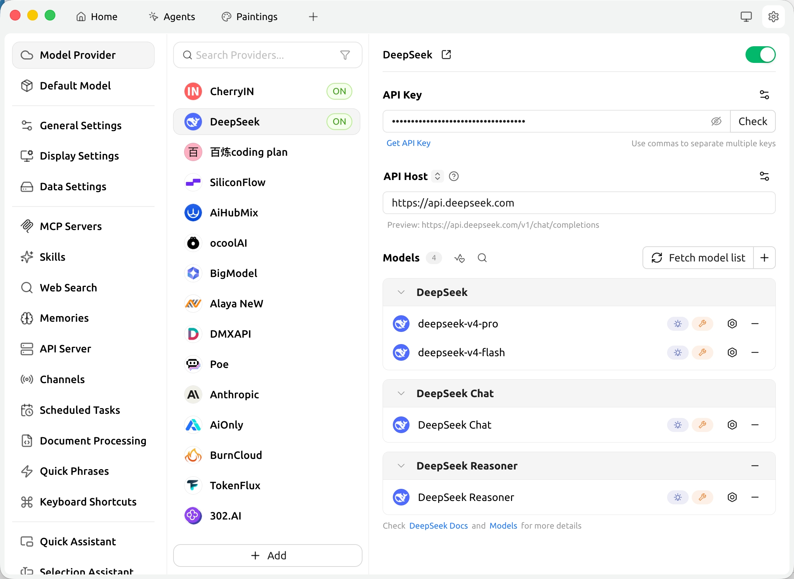
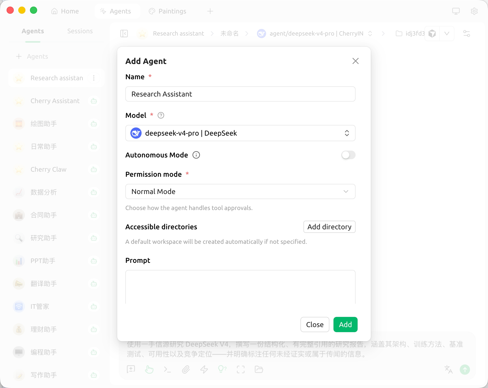
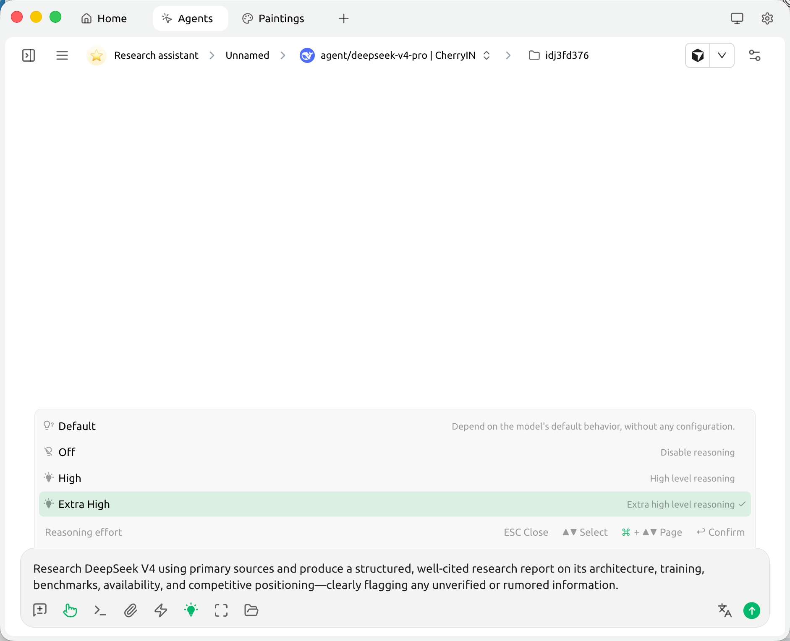

[English](./cherry_studio.md) | [简体中文](./cherry_studio.zh-CN.md) · [← Back](../README.md)

# Integrate with Cherry Studio

Cherry Studio is an open-source desktop AI client for Windows, macOS, and Linux that unifies access to multiple LLM providers. It ships with 300+ pre-configured chat assistants, agents, AI translation, knowledge bases, and MCP servers.

- **GitHub:** <https://github.com/CherryHQ/cherry-studio>
- **Website:** <https://cherry-ai.com>

#### 1. Install Cherry Studio

Download the installer for your platform from the [Cherry Studio releases page](https://github.com/CherryHQ/cherry-studio/releases) or the [official website](https://cherry-ai.com).

Available builds:

- Windows (`.exe`)
- macOS (`.dmg` — Intel and Apple Silicon)
- Linux (`.AppImage` / `.deb` / `.rpm`)

#### 2. Configure the DeepSeek Provider

Open Cherry Studio and click the gear icon in the lower-left corner to open **Settings**.

1. Open **Model Provider** in the left navigation and select **DeepSeek** from the built-in providers list.
2. Paste your [DeepSeek API Key](https://platform.deepseek.com/api_keys) into the **API Key** field. Leave **API Host** as the default `https://api.deepseek.com`.
3. Click **Fetch model list** to load the available DeepSeek models, then add **`deepseek-v4-pro`** and **`deepseek-v4-flash`** to the model list.
4. Toggle the switch in the top-right of the DeepSeek provider page to enable it.

#### 3. Start Chatting

Open the **Agents** tab from the top navigation, click **+ Agents**, give your agent a name, set **Model** to **`deepseek-v4-pro`** (or **`deepseek-v4-flash`**), pick a permission mode, and click **Add**.

Open the new agent and start sending messages. DeepSeek V4 runs with deep thinking enabled by default, and the full **1 million token** context window is available out of the box — no extra configuration required.

To get the strongest reasoning for coding and complex tasks, click the lightbulb icon in the chat input toolbar and select **Extra High** under *Reasoning effort*. Cherry Studio maps it to DeepSeek's `reasoning_effort: "max"` API value.

#### 4. Going Further

Once DeepSeek V4 is configured, you can use it across the rest of Cherry Studio:

- **Knowledge Bases.** Drop PDFs, Markdown, or Office files into the **Knowledge Base** tab to RAG over them with DeepSeek V4.
- **AI Translation.** Open the **Translate** page and pick a DeepSeek V4 model as the translation engine for fast, high-quality translation.
- **MCP Servers.** Add servers under **Settings → MCP**; any DeepSeek-driven conversation can then call their tools.
- **OpenClaw.** Cherry Studio bundles [OpenClaw](https://github.com/CherryHQ/openclaw), a personal AI assistant that connects to chat platforms (Feishu, WeChat, etc.). Install OpenClaw from the **OpenClaw** page in the sidebar and point it at your DeepSeek V4 model to drive your IM bots with DeepSeek.
