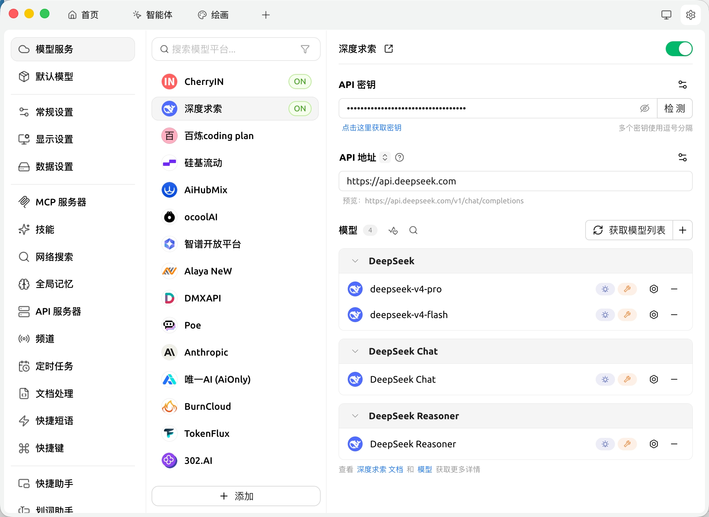
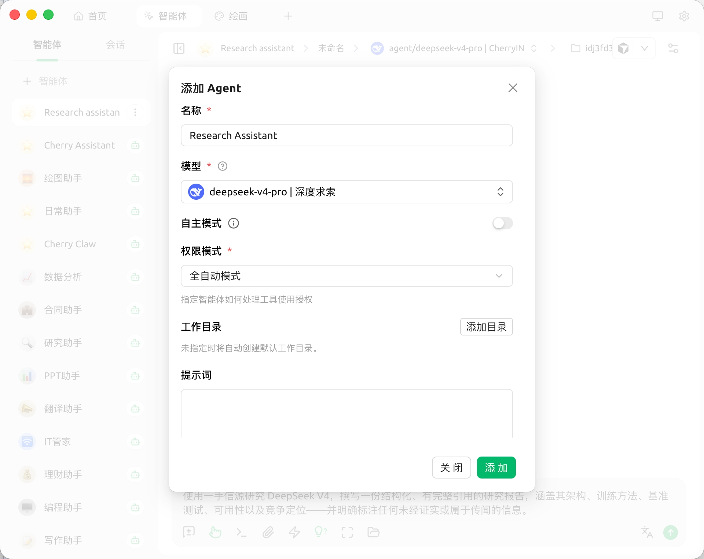
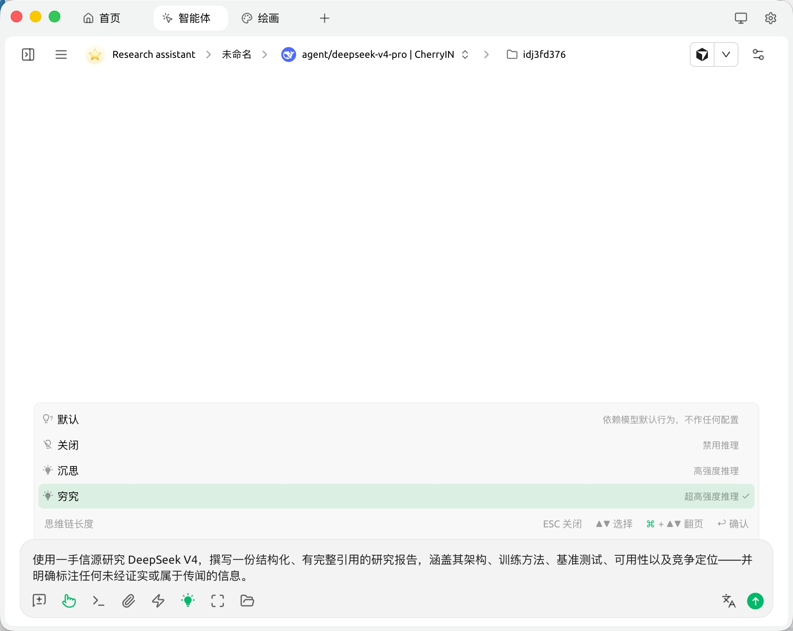

[English](./cherry_studio.md) | [简体中文](./cherry_studio.zh-CN.md) · [← Back](../README.zh-CN.md)

# 接入 Cherry Studio

Cherry Studio 是一款面向 Windows / macOS / Linux 的开源桌面 AI 客户端，可在同一应用内统一接入主流 LLM Provider。内置 300+ 预设对话助手、Agent、AI 翻译、知识库、MCP 服务。

- **GitHub：** <https://github.com/CherryHQ/cherry-studio>
- **官网：** <https://cherry-ai.com>

#### 1. 安装 Cherry Studio

请从 [Cherry Studio Releases](https://github.com/CherryHQ/cherry-studio/releases) 或 [官网](https://cherry-ai.com) 下载对应平台的安装包：

- Windows（`.exe`）
- macOS（`.dmg`，支持 Intel 与 Apple Silicon）
- Linux（`.AppImage` / `.deb` / `.rpm`）

#### 2. 配置 DeepSeek 模型服务

打开 Cherry Studio，点击左下角的齿轮图标进入 **设置**。

1. 在左侧导航中打开 **模型服务**，在内置 Provider 列表里找到 **深度求索（DeepSeek）**。
2. 将 [DeepSeek API Key](https://platform.deepseek.com/api_keys) 粘贴到 **API 密钥** 字段，**API 地址** 保持默认值 `https://api.deepseek.com`。
3. 点击 **获取模型列表** 拉取可用模型，将 **`deepseek-v4-pro`** 与 **`deepseek-v4-flash`** 添加到模型列表。
4. 打开 DeepSeek 服务页面右上角的开关，启用该 Provider。

#### 3. 开始对话

进入顶部 **智能体** 页面，点击 **+ 智能体**，填写名称，**模型** 选择 **`deepseek-v4-pro`**（或 **`deepseek-v4-flash`**），按需选择权限模式，点击 **添加**。

打开新建的 Agent 即可开始对话。DeepSeek V4 默认开启深度思考，且原生支持最高 **100 万 token** 的上下文窗口，Cherry Studio 默认基于完整窗口运行，无需额外配置。

如需在编码或复杂任务中获得最强推理表现，点击输入框工具栏中的灯泡图标，在弹出的 **思维链长度** 菜单中选择 **穷究**。Cherry Studio 会自动把它映射为 DeepSeek API 的 `reasoning_effort: "max"`。

#### 4. 进阶用法

完成 DeepSeek V4 配置后，你可以在 Cherry Studio 的其他场景中复用它：

- **知识库**：将 PDF、Markdown、Office 文件拖入 **知识库** 页面，即可基于 DeepSeek V4 进行 RAG 检索。
- **AI 翻译**：进入 **翻译** 页面，将翻译引擎切换为 DeepSeek V4 模型，即可获得高质量、低延迟的翻译体验。
- **MCP 服务**：在 **设置 → MCP** 中添加 MCP 服务，所有由 DeepSeek 驱动的会话都可以调用其中的工具。
- **OpenClaw**：Cherry Studio 内置 [OpenClaw](https://github.com/CherryHQ/openclaw) —— 一个可接入飞书、微信等聊天平台的个人 AI 助手。在侧边栏的 **OpenClaw** 页面安装并启动 OpenClaw，将其默认模型设置为 DeepSeek V4，即可让你的 IM 机器人由 DeepSeek 驱动。
