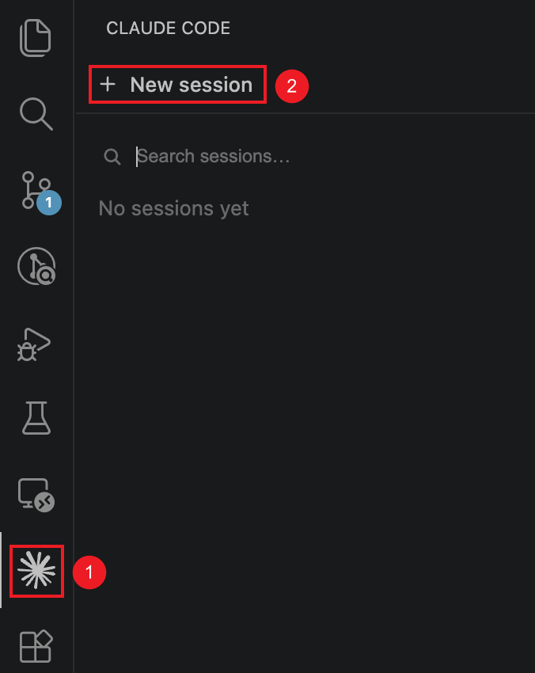

[English](./claude_code.md) | [简体中文](./claude_code.zh-CN.md) · [← 返回](../README.zh-CN.md)

# 接入 Claude Code

Claude Code 是一个运行在终端（或 VSCode Extension）内的 AI 编程助手。

### 从零安装 Claude Code

Claude Code 可以通过 CLI 或者 VSCode Extension 的方式运行，按照使用习惯任选即可。

#### 选项一：安装 Claude Code CLI

- 安装 [Node.js](https://nodejs.org/zh-cn/download/) 18+。
- Windows 用户需安装 [Git for Windows](https://git-scm.com/download/win)。
- 在命令行界面，执行以下命令安装 Claude Code：

```
npm install -g @anthropic-ai/claude-code
```

- 安装结束后，执行以下命令，若显示版本号则安装成功：

```
claude --version
```

#### 选项二：安装 Claude Code VSCode Extension

- 安装 [VSCode](https://code.visualstudio.com/)
- 安装 [Claude Code VSCode Extension](https://marketplace.visualstudio.com/items?itemName=anthropic.claude-code)

安装完成后，搜索 VSCode 的设置项 `claudeCode.disableLoginPrompt` 并将其勾选。

### 配置 Claude Code

Claude Code 可以通过配置文件或环境变量的方法进行配置。在大多数情况下，优先选用配置文件的方法，配置文件中的配置可以被 Claude Code CLI 和 VSCode Extension 共同读取到。

#### 方法一：通过配置文件配置

配置文件位置：
- Linux / Mac 在 `~/.claude/settings.json` 中配置
- Windows 在 `C:\Users\<你的实际用户名>\.claude\settings.json` 中配置
- **以上文件若不存在，自行创建即可**

配置文件内容：

```json
{
  "env": {
    "ANTHROPIC_BASE_URL": "https://api.deepseek.com/anthropic",
    "ANTHROPIC_AUTH_TOKEN": "<你的 DeepSeek API Key>",
    "ANTHROPIC_MODEL": "deepseek-v4-pro[1m]",
    "ANTHROPIC_DEFAULT_OPUS_MODEL": "deepseek-v4-pro[1m]",
    "ANTHROPIC_DEFAULT_SONNET_MODEL": "deepseek-v4-pro[1m]",
    "ANTHROPIC_DEFAULT_HAIKU_MODEL": "deepseek-v4-flash[1m]",
    "CLAUDE_CODE_DISABLE_NONESSENTIAL_TRAFFIC": "1",
    "CLAUDE_CODE_EFFORT_LEVEL": "max"
  }
}
```

#### 方法二：配置环境变量

Linux / Mac 用户执行以下命令配置 [DeepSeek Anthropic API](https://api.deepseek.com/anthropic) 环境变量，其中 API Key 在 [DeepSeek Platform](https://platform.deepseek.com/api_keys) 获取：

```
export ANTHROPIC_BASE_URL=https://api.deepseek.com/anthropic
export ANTHROPIC_AUTH_TOKEN=<你的 DeepSeek API Key>
export ANTHROPIC_MODEL=deepseek-v4-pro[1m]
export ANTHROPIC_DEFAULT_OPUS_MODEL=deepseek-v4-pro[1m]
export ANTHROPIC_DEFAULT_SONNET_MODEL=deepseek-v4-pro[1m]
export ANTHROPIC_DEFAULT_HAIKU_MODEL=deepseek-v4-flash[1m]
export CLAUDE_CODE_DISABLE_NONESSENTIAL_TRAFFIC=1
export CLAUDE_CODE_EFFORT_LEVEL=max
```

Windows 用户执行：

```
$env:ANTHROPIC_BASE_URL="https://api.deepseek.com/anthropic"
$env:ANTHROPIC_AUTH_TOKEN="<你的 DeepSeek API Key>"
$env:ANTHROPIC_MODEL="deepseek-v4-pro[1m]"
$env:ANTHROPIC_DEFAULT_OPUS_MODEL="deepseek-v4-pro[1m]"
$env:ANTHROPIC_DEFAULT_SONNET_MODEL="deepseek-v4-pro[1m]"
$env:ANTHROPIC_DEFAULT_HAIKU_MODEL="deepseek-v4-flash[1m]"
$env:CLAUDE_CODE_DISABLE_NONESSENTIAL_TRAFFIC="1"
$env:CLAUDE_CODE_EFFORT_LEVEL="max"
```

### 使用 Claude Code

#### 使用 Claude Code CLI

进入项目目录，执行 `claude` 命令，即可开始使用了。

```
cd /path/to/my-project
claude
```

<div align="center">

</div>

#### 使用 Claude Code VSCode Extension

用 VSCode 打开项目目录，点击左侧边栏的 Claude Code 图标，并点击 `New session` 即可开始使用。


