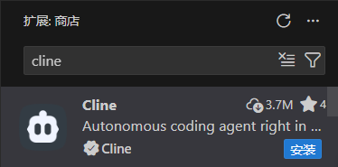
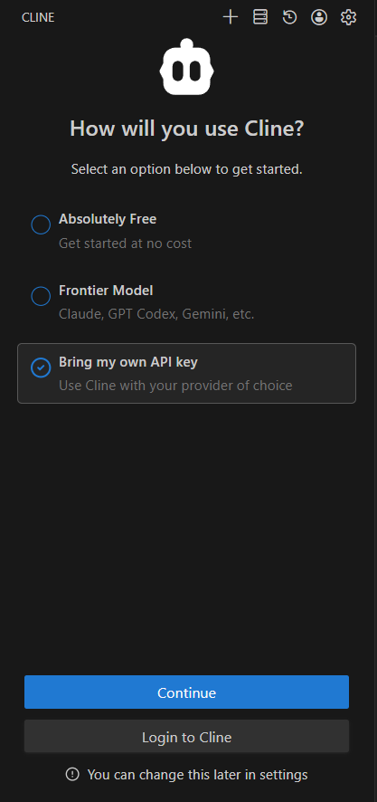
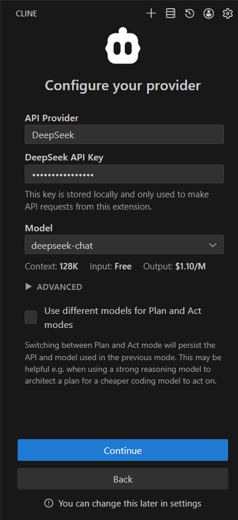
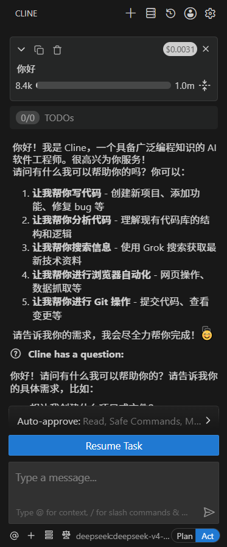
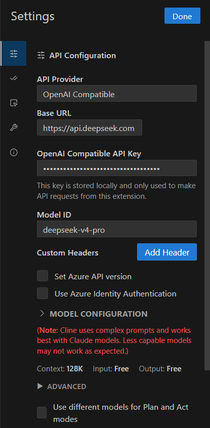
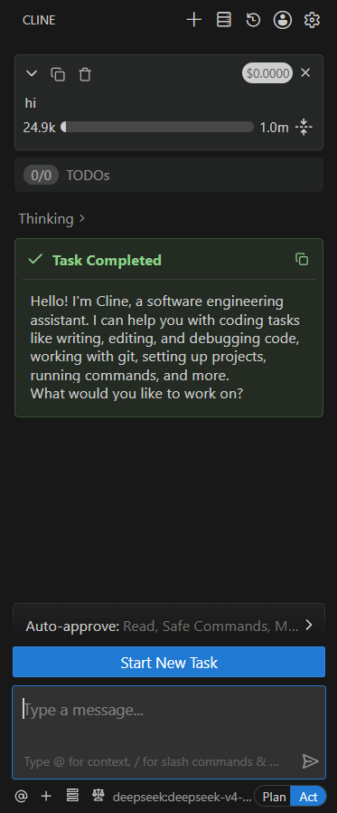

[English](./cline.md) | [简体中文](./cline.zh-CN.md) · [← Back](../README.md)

# Integrate with Cline

Cline is an AI coding assistant that runs as a VS Code extension, supporting multiple API providers and models.

#### 1. Install Cline Extension

- Open VS Code.
- Click the **Extensions** icon in the activity bar (or press `Ctrl+Shift+X`).
- Search for `cline`.
- Find the **Cline** extension in the results.

#### 2. Install and Trust the Extension

- Click the **Install** button.
- After installation completes, choose to trust the developer when prompted.

#### 3. Choose API Key Mode

- In the Cline settings, select **Bring my own API Key**.

#### 4. Configure API Provider

**Method 1: DeepSeek Provider**

- Select **API Provider** as **DeepSeek**.
- Enter your [DeepSeek API Key](https://platform.deepseek.com/api_keys).
- Select the model you want to use.

> **Note:** `deepseek-reasoner` and `deepseek-chat` models will be deprecated soon. Please wait for Cline to officially add `deepseek-v4-pro` and `deepseek-v4-flash` models.

After configuration, you can start using Cline:

**Method 2: OpenAI Compatible**

- Select **API Provider** as **OpenAI Compatible**.
- Set **Base URL** to `https://api.deepseek.com`.
- Enter your [DeepSeek API Key](https://platform.deepseek.com/api_keys).
- Enter **Model ID**, e.g. `deepseek-v4-pro`.
- (Optional) Click **Model Configuration** to adjust window size, temperature, pricing, and limits.

After configuration, you can start using Cline:

