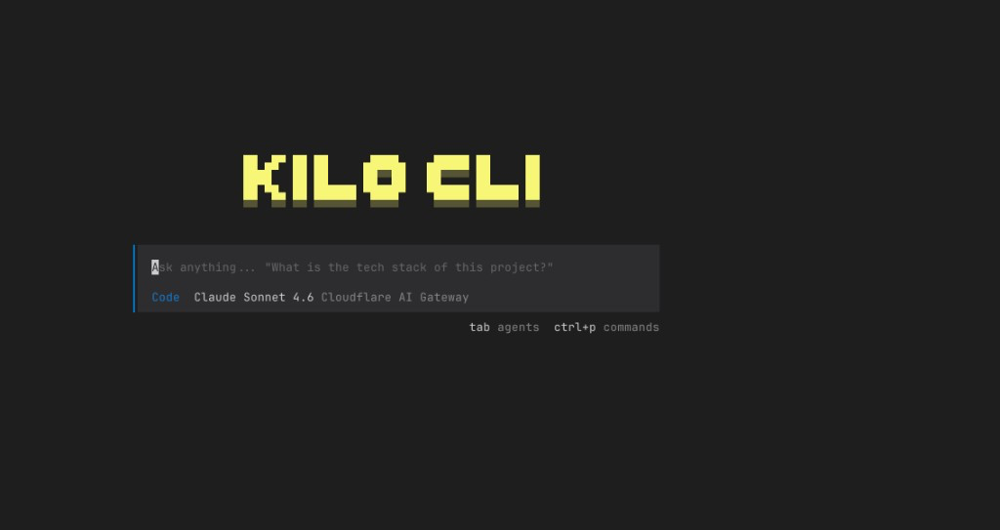
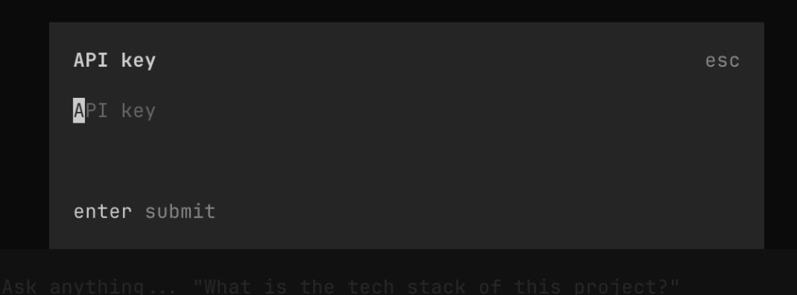
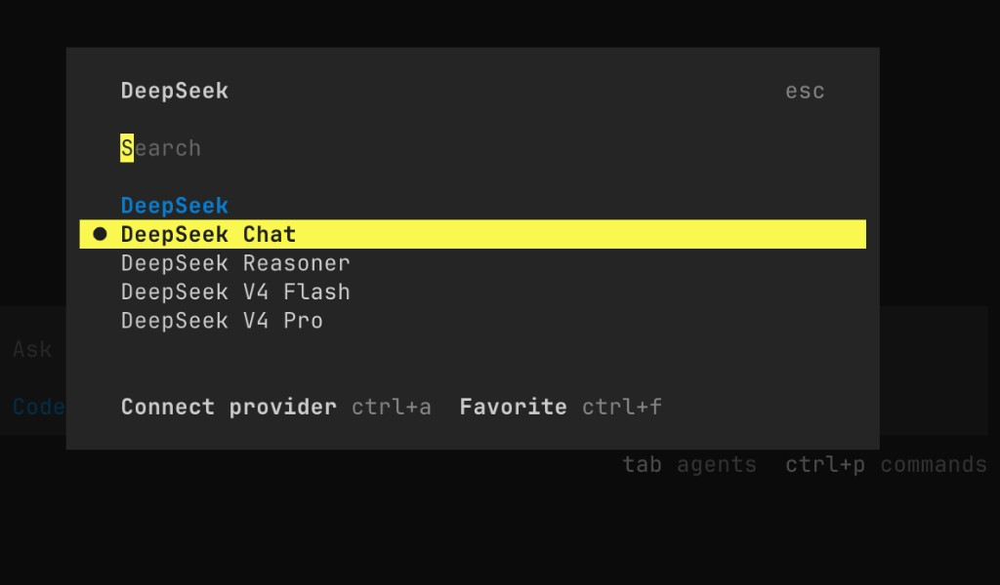

English | [简体中文](./kilo_code.zh-CN.md) · [← 返回](../README.zh-CN.md)

# 接入 Kilo Code

Kilo Code 是一个 AI 编程助手，支持 CLI 和编辑器扩展。

#### 1. 安装 Kilo Code CLI

- 安装 [Node.js](https://nodejs.org/zh-cn/download/)。
- 在命令行界面，执行以下命令安装 Kilo Code CLI：

```
npm install -g @kilocode/cli
```

- 安装结束后，执行以下命令，若显示版本号则安装成功：

```
kilo --version
```

#### 2. 运行 Kilo Code

进入项目目录并执行 `kilo`：

```
cd /path/to/my-project
kilo
```

<div align="center">

</div>

#### 3. 连接 DeepSeek 供应商

- 在命令栏输入 `/connect`，打开 **Connect Provider** 面板。

<div align="center">

</div>

- 搜索 `deepseek`，选择 **DeepSeek**，然后填入你的 [DeepSeek API Key](https://platform.deepseek.com/api_keys)。

<div align="center">

</div>

#### 4. 选择 DeepSeek 模型

- 输入 `/models` 打开模型选择器。
- 选择一个可用的 DeepSeek 模型：
  - DeepSeek Chat
  - DeepSeek Reasoner
  - DeepSeek V4 Flash
  - DeepSeek V4 Pro

<div align="center">

</div>

