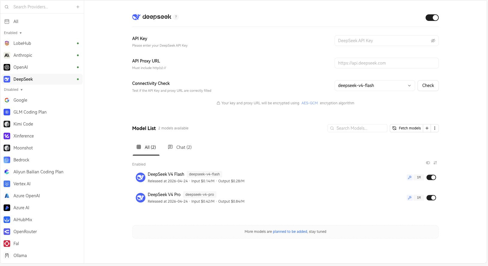
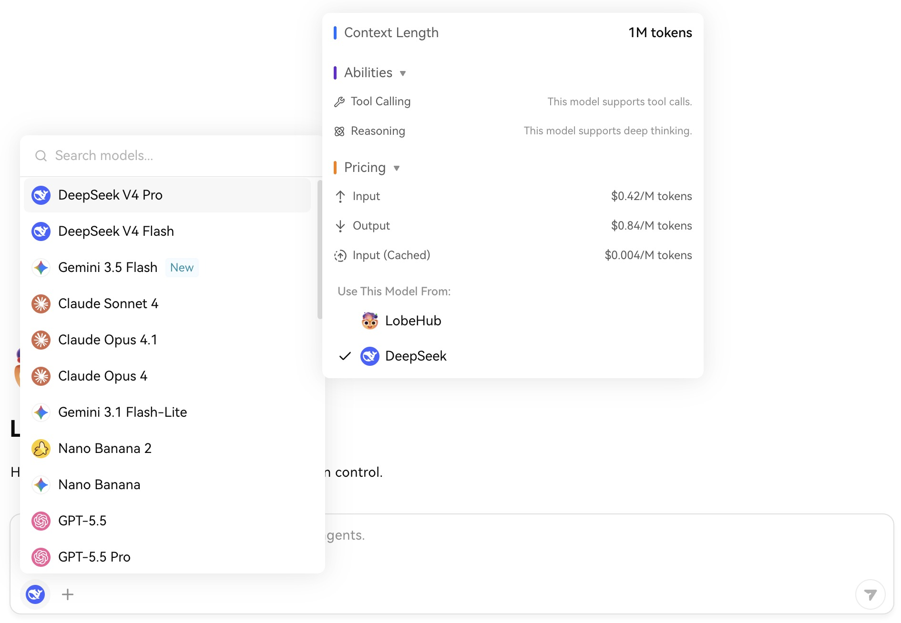

[English](./lobehub.md) | [简体中文](./lobehub.zh-CN.md) · [← Back](../README.md)

# Integrate with LobeHub

LobeHub is your Chief Agent Operator. It organizes your agents into 7×24 operation. It hires, schedules, reports on your entire AI team. You stay in charge — without staying online.

- **GitHub:** <https://github.com/lobehub/lobehub>
- **Website:** <https://lobehub.com>
- **Web app:** <https://app.lobehub.com>
- **Desktop:** <https://lobehub.com/downloads/mac>

#### 1. Prepare LobeHub and a DeepSeek API Key

Use the hosted web app, the desktop app, or a self-hosted LobeHub instance:

- Web: open [app.lobehub.com](https://app.lobehub.com).
- Desktop: download the macOS app from the [LobeHub download page](https://lobehub.com/downloads/mac).
- Self-hosted: make sure your instance is updated to a recent build that includes DeepSeek V4 models.

Then create an API Key from the [DeepSeek Platform](https://platform.deepseek.com/api_keys).

#### 2. Configure the DeepSeek Provider

Open LobeHub and go to **Settings → Service Model**. You can also open the DeepSeek provider page directly:

```
https://app.lobehub.com/settings/provider/deepseek
```

1. Select **DeepSeek** in the provider list.
2. Make sure the provider switch in the upper-right corner is enabled.
3. Paste your DeepSeek API Key into **API Key**.
4. Leave **API Proxy URL** empty unless you use a custom proxy. The default endpoint is `https://api.deepseek.com`.
5. Optional: click **Check** under **Connectivity Check**. LobeHub uses `deepseek-v4-flash` as the default check model.
6. In **Model List**, confirm that **DeepSeek V4 Pro** and **DeepSeek V4 Flash** are enabled. If needed, click **Fetch models** to refresh the provider model list.

<div align="center">

<br />
<sub>DeepSeek provider settings in the LobeHub web app opened with Chrome.</sub>
</div>

#### 3. Select a DeepSeek V4 Model

Return to **Home** or open any agent chat.

1. Click the current model chip in the chat input toolbar.
2. Search for `DeepSeek V4`.
3. Choose **DeepSeek V4 Pro** for coding, long-horizon planning, and agent workflows, or **DeepSeek V4 Flash** for lower-latency everyday chat.
4. Send a message to start the conversation.

<div align="center">

<br />
<sub>DeepSeek V4 models in the LobeHub desktop app model selector.</sub>
</div>

DeepSeek V4 models expose a **1M context window** in LobeHub. The built-in model cards already carry the right context metadata, so no separate context-window setting is required.

#### 4. Tune Reasoning Intensity

DeepSeek V4 thinking mode is available in LobeHub's model parameter controls, opened from the upper-right corner of the chat page. For normal usage, keep the default **high** reasoning intensity. For difficult coding, planning, and multi-step agent tasks, set **Reasoning Intensity** to **max**.

Available DeepSeek V4 reasoning levels in LobeHub:

- `none`
- `high`
- `max`

#### 5. Optional: Self-Hosting Environment Variables

If you self-host LobeHub and want the server to provide DeepSeek credentials globally, add the following environment variables and restart the service:

```bash
DEEPSEEK_API_KEY=sk-xxxxxx
DEEPSEEK_PROXY_URL=https://api.deepseek.com
```

To restrict the visible DeepSeek model list to V4 models only, add:

```bash
DEEPSEEK_MODEL_LIST=-all,+deepseek-v4-pro,+deepseek-v4-flash
```

For most hosted web and desktop users, the UI configuration in **Settings → Service Model → DeepSeek** is enough.

#### Troubleshooting

- `401` or authentication errors: recheck the API Key and make sure it is pasted into **API Key**, not **API Proxy URL**.
- Model not found: refresh the model list and confirm that the enabled model ids are `deepseek-v4-pro` and `deepseek-v4-flash`.
- Connection check fails with a proxy: the proxy URL must include `http://` or `https://` and should route to the DeepSeek-compatible API endpoint.
- Reasoning controls are missing: make sure you selected **DeepSeek V4 Pro** or **DeepSeek V4 Flash**, not another provider's routed model.
