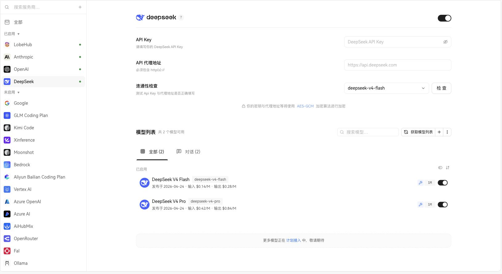
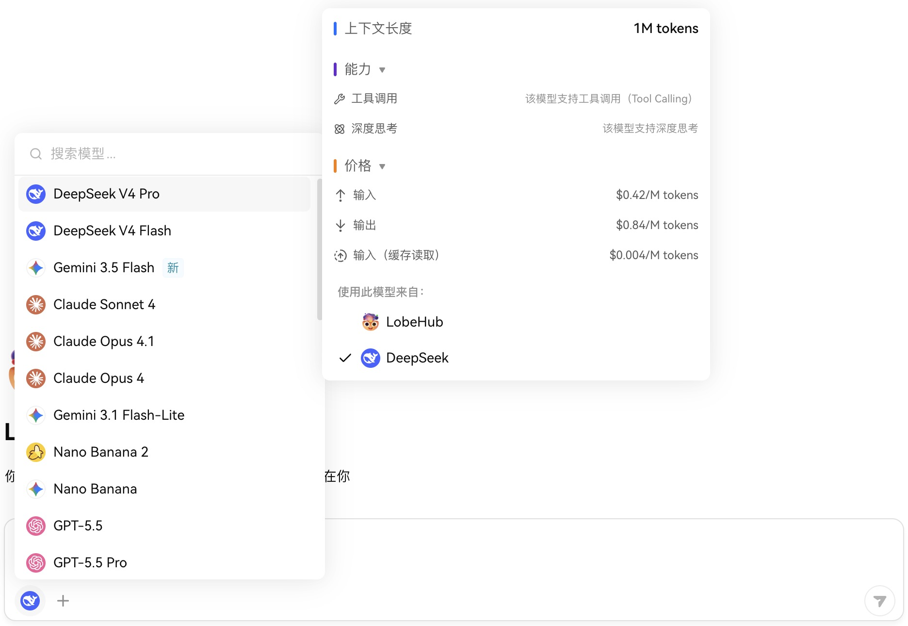

[English](./lobehub.md) | [简体中文](./lobehub.zh-CN.md) · [← 返回](../README.zh-CN.md)

# 接入 LobeHub

LobeHub 是你的 Chief Agent Operator。它将你的 Agent 组织成 7×24 小时运作。它会为你的整个 AI 团队进行招聘、排班并生成报告。你始终掌控全局——无需一直在线。

- **GitHub：** <https://github.com/lobehub/lobehub>
- **官网：** <https://lobehub.com>
- **网页端：** <https://app.lobehub.com>
- **桌面端：** <https://lobehub.com/downloads/mac>

#### 1. 准备 LobeHub 与 DeepSeek API Key

你可以使用 LobeHub 网页端、桌面端或自托管实例：

- 网页端：打开 [app.lobehub.com](https://app.lobehub.com)。
- 桌面端：从 [LobeHub 下载页](https://lobehub.com/downloads/mac) 获取 macOS 应用。
- 自托管：请确认实例已升级到包含 DeepSeek V4 模型的较新版本。

然后前往 [DeepSeek 开放平台](https://platform.deepseek.com/api_keys) 创建 API Key。

#### 2. 配置 DeepSeek 模型服务

打开 LobeHub，进入 **设置 → 服务模型**。也可以直接打开 DeepSeek Provider 页面：

```
https://app.lobehub.com/settings/provider/deepseek
```

1. 在模型服务商列表中选择 **DeepSeek**。
2. 确认右上角的 Provider 开关已开启。
3. 将 DeepSeek API Key 粘贴到 **API Key**。
4. 除非你使用自定义代理，**API 代理地址** 可以保持为空；默认端点是 `https://api.deepseek.com`。
5. 可选：点击 **连通性检查** 中的 **检查**。LobeHub 默认使用 `deepseek-v4-flash` 作为检查模型。
6. 在 **模型列表** 中确认 **DeepSeek V4 Pro** 与 **DeepSeek V4 Flash** 已启用。如需刷新模型列表，点击 **获取模型列表**。

<div align="center">

<br />
<sub>在 Chrome 中打开 LobeHub 网页端的 DeepSeek 模型服务配置页。</sub>
</div>

#### 3. 选择 DeepSeek V4 模型

回到 **首页** 或打开任意 Agent 对话。

1. 点击输入框工具栏中的当前模型标签。
2. 搜索 `DeepSeek V4`。
3. 编码、长程规划和 Agent 工作流建议选择 **DeepSeek V4 Pro**；日常对话和低延迟场景可以选择 **DeepSeek V4 Flash**。
4. 发送消息即可开始对话。

<div align="center">

<br />
<sub>LobeHub 桌面端模型选择器中的 DeepSeek V4 模型。</sub>
</div>

DeepSeek V4 模型在 LobeHub 中会显示 **100 万 token 上下文窗口**。内置模型卡片已经包含正确的上下文元数据，无需额外配置上下文长度。

#### 4. 调整推理强度

LobeHub 会在 DeepSeek V4 的模型参数控制（在对话页面的右上角打开）中提供思考模式配置。日常使用保持默认 **high** 推理强度即可；复杂编码、规划、多步骤 Agent 任务建议将 **推理强度** 调整为 **max**。

LobeHub 中 DeepSeek V4 可用的推理强度：

- `none`
- `high`
- `max`

#### 5. 可选：自托管环境变量

如果你自托管 LobeHub，并希望在服务端全局提供 DeepSeek 凭据，可以添加以下环境变量并重启服务：

```bash
DEEPSEEK_API_KEY=sk-xxxxxx
DEEPSEEK_PROXY_URL=https://api.deepseek.com
```

如果只想显示 DeepSeek V4 模型，可以继续添加：

```bash
DEEPSEEK_MODEL_LIST=-all,+deepseek-v4-pro,+deepseek-v4-flash
```

对于大多数网页端和桌面端用户，在 **设置 → 服务模型 → DeepSeek** 中完成 UI 配置即可。

#### 常见问题

- `401` 或鉴权失败：检查 API Key 是否正确，并确认它填在 **API Key**，不是 **API 代理地址**。
- 找不到模型：刷新模型列表，并确认已启用的模型 id 是 `deepseek-v4-pro` 和 `deepseek-v4-flash`。
- 使用代理时连通性检查失败：代理地址必须包含 `http://` 或 `https://`，并且应转发到 DeepSeek 兼容 API 端点。
- 看不到推理强度控制：确认当前选择的是 **DeepSeek V4 Pro** 或 **DeepSeek V4 Flash**，而不是其他服务商的转发模型。
